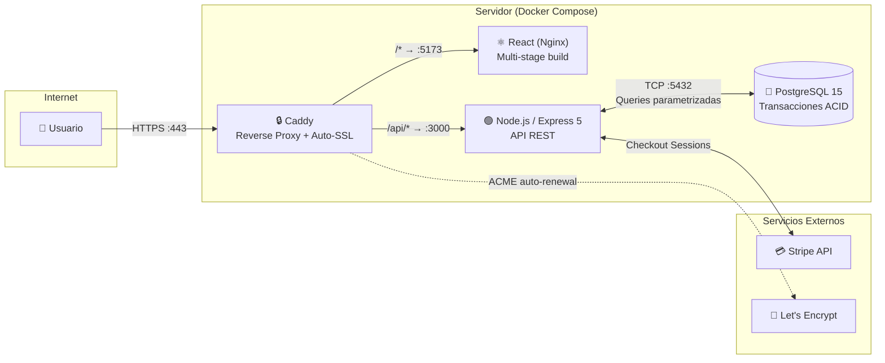

<div align="center">
  <h1>✨ Pinky Cosmetics — Full-Stack E-Commerce Platform</h1>
  <p><strong>Plataforma B2C de comercio electrónico construida desde cero con React, Node.js, PostgreSQL, Stripe y una infraestructura dockerizada con HTTPS automático.</strong></p>

  
  
  
  
  
  
  
</div>

<br />

> 🌐 **Live Demo:** [https://benjaminabde.dev](https://benjaminabde.dev)  
> 💳 **Para probar compras:** Usa la tarjeta de prueba de Stripe `4242 4242 4242 4242`. La fecha puede ser cualquier fecha futura (ej: `12/34`) y el CVC cualquier número de 3 dígitos (ej: `123`).

---

## 📌 Sobre el Proyecto

Un sistema completo de comercio electrónico diseñado como **monorepo full-stack**. Cada pieza fue construida desde cero con foco en tres pilares: **experiencia de usuario (UX), seguridad a nivel de servidor y una arquitectura lista para producción**. El proyecto incluye integración con pagos reales (Stripe), una infraestructura completamente dockerizada con HTTPS automático (Caddy + Let's Encrypt), y un panel de administración con gestión completa de inventario.

---

## 🏗️ Arquitectura del Sistema



> **¿Por qué este diseño?** Caddy actúa como punto de entrada único: termina el TLS, enruta `/api/*` al backend y el resto al frontend. Los contenedores de React y Node.js **no exponen puertos al exterior**, lo que reduce la superficie de ataque. Caddy obtiene y renueva los certificados SSL automáticamente mediante el protocolo ACME con Let's Encrypt.

---

## 🚀 Funcionalidades

### 🛒 Experiencia de Cliente (B2C)
| Funcionalidad | Detalle de implementación |
|---|---|
| **Catálogo con filtros combinables** | Búsqueda por texto, color, categoría, rango de precio y ordenamiento — construidos con query params dinámicos y consultas SQL parametrizadas |
| **Paginación server-side** | Custom hook `usePagination` con estrategia `LIMIT N+1` para detección de "hay más resultados" sin query de conteo extra |
| **Carrito persistente** | Estado global vía `CartContext` (React Context API), sincronizado con la BD en tiempo real. Badge reactivo en el Header |
| **Control de cantidades en carrito** | Botones `[−] cantidad [+]` con validación de stock en cada clic contra la BD |
| **Checkout con Stripe** | Integración Stripe Checkout Sessions con manejo de moneda zero-decimal (CLP), verificación server-side del pago y página de éxito |
| **Historial de compras** | Consulta optimizada con `json_agg` + `json_build_object` para devolver boletas con sus productos anidados en una sola query (evitando N+1) |
| **Skeleton Loaders** | Componentes de carga animados que reemplazan el contenido real mientras se obtienen datos de la API |

### 🛡️ Seguridad y Autenticación
| Capa | Implementación |
|---|---|
| **Autenticación stateless** | JWT con expiración de 7 días. El frontend decodifica el payload Base64 para verificar expiración sin necesitar un round-trip al servidor |
| **Hashing de contraseñas** | `bcryptjs` con salt de 10 rondas |
| **Autorización RBAC** | Middleware chain: `verifyToken → verifyAdmin`. Las rutas de admin (`/crear`, `/eliminar`, `/editar`) están protegidas en el servidor. En el frontend, `AdminRoute` y `ProtectedRoute` envuelven las rutas con guards |
| **Validación de entrada** | `express-validator` sanitiza y valida cada campo de registro/login antes de llegar al controlador |
| **Rate Limiting** | `express-rate-limit` en rutas de auth: máximo 10 intentos por IP cada 15 minutos |
| **Prevención de SQL Injection** | Todas las queries usan consultas parametrizadas (`$1, $2, ...`) del driver `pg`, nunca interpolación de strings |
| **CORS estricto** | Whitelist configurable por variable de entorno. Orígenes no autorizados son rechazados con log de advertencia |

### 🔒 Integridad Transaccional
La compra del carrito se ejecuta dentro de una **transacción PostgreSQL con bloqueo pesimista** (`SELECT ... FOR UPDATE`):
1. Se bloquean las filas de stock para evitar race conditions.
2. Se valida disponibilidad de **todos** los productos antes de modificar nada.
3. Se crea la boleta, se insertan los detalles, se descuenta stock y se limpia el carrito.
4. Si cualquier paso falla → `ROLLBACK` automático. Si todo es correcto → `COMMIT`.

```javascript
// Extracto simplificado de comprarCarrito (carritoController.js)
await client.query("BEGIN");
for (const producto of items) {
    const stockCheck = await client.query(
        "SELECT stock FROM producto WHERE id_producto = $1 FOR UPDATE", [id]
    );
    if (stock < cantidad) { await client.query("ROLLBACK"); return res.status(400)... }
}
// ... insertar boleta, descontar stock ...
await client.query("COMMIT");
```

### ⚙️ Panel de Administración (Backoffice)
- **CRUD completo de productos** (crear, editar, eliminar con borrado lógico `activo = false`).
- **Gestión de órdenes:** Visualización de todas las boletas y actualización de estado.
- **Protección total:** Cada endpoint de admin pasa por `verifyToken` + `verifyAdmin` en el servidor.

---

## 🛠️ Stack Tecnológico

| Capa | Tecnologías |
|------|-------------|
| **Frontend** | React 18, React Router 6, Vite, CSS Modules (Vanilla), React Hot Toast, Context API (Auth + Cart) |
| **Backend** | Node.js, Express 5, JSON Web Tokens, express-validator, express-rate-limit, bcryptjs |
| **Base de Datos** | PostgreSQL 15 (driver `pg`), transacciones ACID, bloqueo pesimista `FOR UPDATE` |
| **Pagos** | Stripe Checkout API (zero-decimal currency CLP) |
| **Infraestructura** | Docker Compose (5 servicios), Nginx (multi-stage build para el frontend), Caddy 2 (reverse proxy + auto-SSL) |
| **Certificados** | Let's Encrypt (ACME automático vía Caddy) para dominio `.dev` (HSTS obligatorio) |

---

## 📸 Capturas de Pantalla

Inicio
> 

Catálogo
> 

Pasarela de Pago
> 

Panel de Administración
> 

---

## 📂 Estructura del Proyecto

```
fullstack-ecommerce-monorepo/
├── client/                          # Frontend (React + Vite)
│   ├── src/
│   │   ├── components/              # 13 componentes reutilizables (Header, Filter, Skeleton...)
│   │   ├── Pages/                   # 11 páginas (Home, Products, Checkout, Admin...)
│   │   ├── context/                 # AuthContext (JWT) + CartContext (estado global del carrito)
│   │   ├── hooks/                   # usePagination (paginación server-side con LIMIT N+1)
│   │   └── index.css                # Design tokens globales (CSS custom properties)
│   ├── Dockerfile                   # Multi-stage: Node build → Nginx serve
│   └── nginx.conf                   # SPA routing (try_files → index.html)
│
├── server/                          # Backend (Node.js + Express 5)
│   ├── controllers/                 # auth, producto, carrito, boleta, stripe, conexion
│   ├── middlewares/                  # verifyToken, verifyAdmin, validateInput
│   ├── routes/                      # Definición de endpoints REST
│   ├── config/db.js                 # Pool de conexiones PostgreSQL
│   └── Dockerfile                   # Node 18 Alpine
│
├── Caddyfile                        # Reverse proxy config + auto-HTTPS
├── docker-compose.yml               # Orquestación: db, pgadmin, backend, frontend, caddy
├── CreacionDB.sql                   # DDL: tablas, constraints, checks
└── PoblamientoPruebaDB.sql          # Datos de prueba (seed)
```

---

## ⚙️ Despliegue

### Pre-requisitos
- Docker y Docker Compose instalados en el servidor.
- Un dominio apuntando a la IP del servidor (registros DNS tipo A).
- Cuenta de Stripe (llaves de prueba o producción).

### 1. Variables de Entorno
Crea un archivo `server/.env`:
```env
PORT=3000
DB_USER=tu_usuario
DB_PASSWORD=tu_contraseña_segura
DB_HOST=db
DB_PORT=5432
DB_NAME=tienda_db
JWT_SECRET=tu_secreto_jwt_largo_y_seguro
FRONTEND_URL=https://tudominio.dev
STRIPE_SECRET_KEY=sk_test_...
```

Crea un archivo `client/.env.production`:
```env
VITE_API_URL=https://tudominio.dev/api
VITE_STRIPE_PUBLIC_KEY=pk_test_...
```

### 2. Levantar la Infraestructura
```bash
docker compose up -d --build
```

Esto levanta 5 contenedores:
| Servicio | Descripción |
|---|---|
| `caddy` | Reverse proxy con HTTPS automático (puertos 80 y 443) |
| `frontend` | React compilado servido por Nginx (interno, sin puerto expuesto) |
| `backend` | API REST Node.js/Express (interno, sin puerto expuesto) |
| `db` | PostgreSQL 15 |
| `pgadmin` | Panel de administración de BD (puerto 5050) |

### 3. Poblar la Base de Datos (primer inicio)
```bash
docker exec -i postgres_tienda psql -U tu_usuario -d tienda_db < CreacionDB.sql
docker exec -i postgres_tienda psql -U tu_usuario -d tienda_db < PoblamientoPruebaDB.sql
```

---

## 👨‍💻 Desarrollo Local

Si prefieres correr en modo desarrollo con hot-reload:

```bash
# Terminal 1: Base de datos (solo Postgres y PgAdmin)
docker compose up db pgadmin -d

# Terminal 2: Backend
cd server
npm install
npm run dev    # nodemon con hot-reload

# Terminal 3: Frontend
cd client
npm install
npm run dev    # Vite dev server
```

> **Nota:** En desarrollo local, el frontend apunta a `http://localhost:3000` (definido en `client/.env`). No se usa Caddy ni HTTPS.

---

*Construido con dedicación aplicando buenas prácticas de ingeniería de software.*
