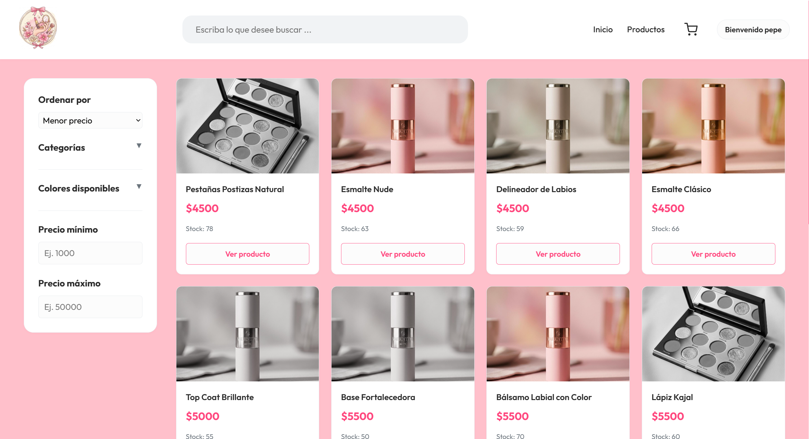
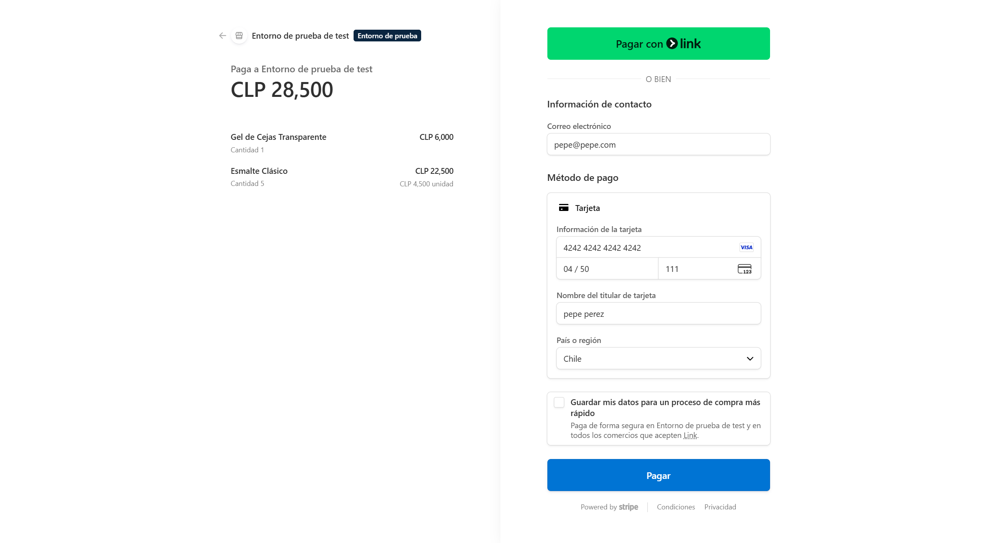
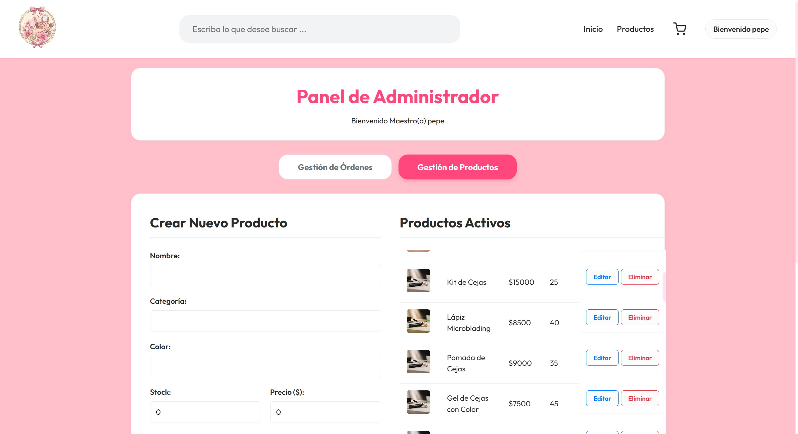
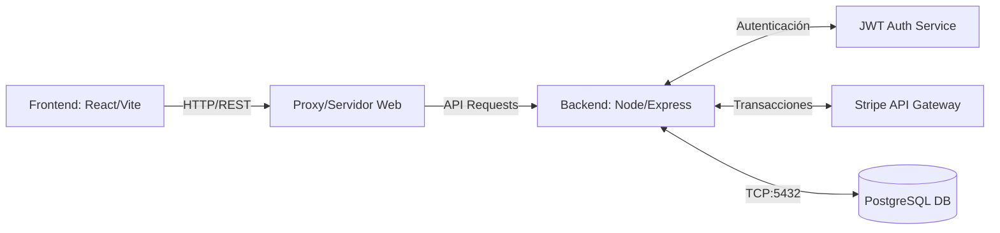

<div align="center">
  <h1>✨ Pinky Cosmetics E-Commerce</h1>
  <p><strong>Plataforma Full-Stack de Comercio Electrónico B2C con Integración de Pagos</strong></p>

  
  
  
  
  
</div>

<br />

> 🌐 **Live Demo:** [http://148.116.109.251:5173/](http://148.116.109.251:5173/)  
> 💳 **Para probar compras reales (Modo Test):** Usa la tarjeta de prueba de Stripe introduciendo reiteramente `42` (`4242 4242 4242 4242`). La fecha de caducidad y el CVC pueden ser cualquier número válido en el futuro (ej: `12/34` y `123`).

Un sistema completo de comercio electrónico diseñado con arquitectura cliente-servidor (monorepo). Construido desde cero con un enfoque en la experiencia de usuario (UX), seguridad y escalabilidad, integrando transacciones financieras reales mediante Stripe y una infraestructura dockerizada para despliegues instantáneos.

## 🚀 Características Principales

### 🛒 Experiencia de Cliente (B2C)
- **Catálogo Dinámico:** Navegación de productos con loaders (Skeleton) y diseño responsive.
- **Carrito de Compras Persistente:** Gestión de estado en tiempo real.
- **Checkout Seguro:** Integración con API de Stripe para procesamiento de pagos (Zero-decimal currency handling).
- **Historial de Órdenes:** Desglose detallado de compras pasadas con consultas SQL optimizadas (uso de `json_agg` para evitar problemas N+1).

### 🛡️ Seguridad y Autenticación
- **JWT (JSON Web Tokens):** Autenticación sin estado para proteger endpoints privados.
- **RBAC (Role-Based Access Control):** Rutas y vistas protegidas dependiendo de si eres Cliente o Administrador.
- **Rate Limiting:** Prevención de ataques de fuerza bruta en el Login (`express-rate-limit`).
- **Seguridad en BD:** Hashing de contraseñas con `bcryptjs` y prevención de inyección SQL mediante consultas parametrizadas (`pg`).

### ⚙️ Panel de Administración (Backoffice)
- **Gestión de Inventario:** CRUD completo de productos (Crear, Leer, Actualizar, Borrar).
- **Control de Stock:** Validación estricta en el servidor para evitar sobreventas.
- **Gestión de Órdenes:** Visualización de todas las boletas de la tienda y métricas de negocio.

## 📸 Capturas de Pantalla

*
> 
INICIO
> 

Catálogo
> 

Pasarela de Pago
> 

Panel de Administración
> 

## 🏗️ Arquitectura del Sistema



## 🛠️ Stack Tecnológico

| Capa | Tecnologías |
|------|-------------|
| **Frontend** | React 18, React Router, Vite, Vanilla CSS Modules, React Hot Toast |
| **Backend** | Node.js, Express.js, JSON Web Tokens, Express Validator |
| **Base de Datos** | PostgreSQL (pg), Transacciones ACID |
| **DevOps** | Docker, Docker Compose, Nginx (Multi-stage build) |
| **Integraciones** | Stripe Checkout API |

## ⚙️ Despliegue Rápido (Docker)

El proyecto está completamente dockerizado para garantizar que funcione en cualquier máquina sin necesidad de configurar Node o Postgres manualmente.

### Pre-requisitos
- Docker y Docker Compose instalados.
- Cuenta de Stripe (para llaves de prueba).

### 1. Variables de Entorno
Crea un archivo `.env` en la carpeta `server/` basándote en el archivo de ejemplo (debes configurarlo con tus llaves):
```env
PORT=3000
DB_USER=benja
DB_PASSWORD=contraseña123
DB_HOST=db
DB_PORT=5432
DB_NAME=tienda_db
JWT_SECRET=tu_secreto_seguro
FRONTEND_URL=http://localhost:5173
STRIPE_SECRET_KEY=sk_test_...
```

Crea un `.env` en la carpeta `client/`:
```env
VITE_API_URL=http://localhost:3000
VITE_STRIPE_PUBLIC_KEY=pk_test_...
```

### 2. Levantar la Infraestructura
En la raíz del proyecto, ejecuta:
```bash
docker-compose up -d --build
```
¡Listo! La aplicación estará disponible en:
- **Frontend:** `http://localhost:5173`
- **Backend API:** `http://localhost:3000`
- **PgAdmin (Gestor de BD):** `http://localhost:5050`

### 3. Poblar la Base de Datos (Primer inicio)
Como la base de datos de Docker inicia vacía, debes inyectar las tablas y los productos iniciales. Ejecuta estos dos comandos en tu terminal (en la raíz del proyecto):

```bash
docker exec -i postgres_tienda psql -U benja -d tienda_db < CreacionDB.sql
docker exec -i postgres_tienda psql -U benja -d tienda_db < poblamiento.sql
```

## 👨‍💻 Comandos de Desarrollo (Sin Docker)
Si prefieres correrlo en modo desarrollo local para ver cambios en tiempo real:

```bash
# Terminal 1: Backend
cd server
npm install
npm run dev

# Terminal 2: Frontend
cd client
npm install
npm run dev
```

---
*Construido con dedicación aplicando buenas prácticas de ingeniería de software.*
